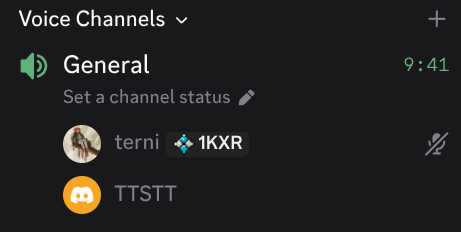

# TTSTT (Text To Speech To Text)

By: Noelle Evanich, Diego Silva, Dana Steinke

**Discord bot that reads selected users' text messages aloud in voice channels—with per-user synthetic voices—so text-first and non-verbal members are heard during live hangs.**

[](https://discord.com/oauth2/authorize?client_id=1496265708215075016)

## Demo

| | |
|---|---|
| **Demo video** | [YouTube — TTSTT W10 demo](https://youtu.be/iY03F8pIJqQ) |
| **Live bot** | [Add to your server](https://discord.com/oauth2/authorize?client_id=1496265708215075016) |
| **Help guide** | [kaleidoscopic-crostata-402ea4.netlify.app](https://kaleidoscopic-crostata-402ea4.netlify.app/) |
| **Code freeze** | [`demo-night` tag](https://github.com/CSEN-SCU/csen-174-s26-team-project-ttstt/tree/demo-night) (`e76c197`) |



## Technical report

Process narrative, architecture evolution, and sprint retrospectives: **[TECHNICAL_REPORT.md](TECHNICAL_REPORT.md)** (export to PDF for course submission).

## What it does today

This repository contains a working deployable Discord bot at [`apps/bot`](apps/bot):

- Voice control: `/join`, `/leave`, `/status`
- TTS listener controls: `/tts_listen_user`, `/tts_stop_listening`
- Per-user voice preferences (Postgres-backed): `/tts_voice_set`, `/tts_voice_show`, `/tts_voice_reset`
- Provider switch: `/tts_provider_set` (Deepgram Aura or local Piper)

Speech-to-text is not part of the deployable bot today; see [`docs/product-vision.md`](docs/product-vision.md).

See [`apps/bot/README.md`](apps/bot/README.md) for setup and usage.

## How to run it

```bash
python -m venv .venv
source .venv/bin/activate
pip install -r apps/bot/requirements.txt
python -m apps.bot.main
```

Required env vars in `.env`:

- `DISCORD_TOKEN`
- `DEEPGRAM_API_KEY` (or Piper-only setup — see bot README)
- `DATABASE_URL`
- `HELP_URL` (Netlify help site URL)

Before first run, start Postgres and initialize the schema:

```bash
docker compose -f infra/docker-compose.yml up -d
python -m apps.bot.init_db
```

## Repository layout

| Location | Purpose |
|---|---|
| [`apps/bot`](apps/bot) | Consolidated deployable Discord bot |
| [`unittests`](unittests) | pytest suite (runs in CI) |
| [`infra`](infra) | Local Postgres Docker Compose |
| [`docs`](docs) | Product vision, architecture retrospective, course artifacts |
| [`architecture`](architecture) | W4 target architecture (C4 diagrams) |
| [`prototypes`](prototypes) | Earlier member prototypes and experiments |

## Course artifacts

| Artifact | Location |
|----------|----------|
| Product vision (W2) | [`docs/product-vision.md`](docs/product-vision.md) |
| Architecture W4 | [`architecture/architecture.md`](architecture/architecture.md) |
| Architecture W8 / as-built | [`docs/architechture-retrospective.md`](docs/architechture-retrospective.md) |
| Testing plan (W5) | [`docs/sprint-1-testing.md`](docs/sprint-1-testing.md) |
| CI/CD (W6) | [`docs/sprint-1-cicd.md`](docs/sprint-1-cicd.md) |
| Red-team report (W7) | [`docs/red-team-report-ttstt-received.md`](docs/red-team-report-ttstt-received.md) |
| Ethics reflection (W9) | [`docs/ethics-reflection.md`](docs/ethics-reflection.md) |
| Sprint retros | [`docs/sprint-1-retro.md`](docs/sprint-1-retro.md), [`docs/sprint-2-retro.md`](docs/sprint-2-retro.md) |
| Sprint board | [CSEN-SCU Project #4](https://github.com/orgs/CSEN-SCU/projects/4) |
