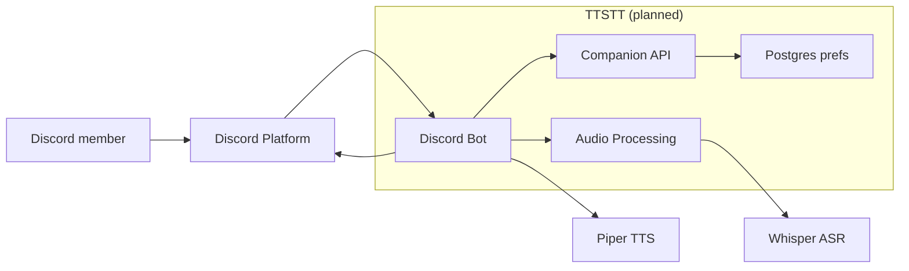
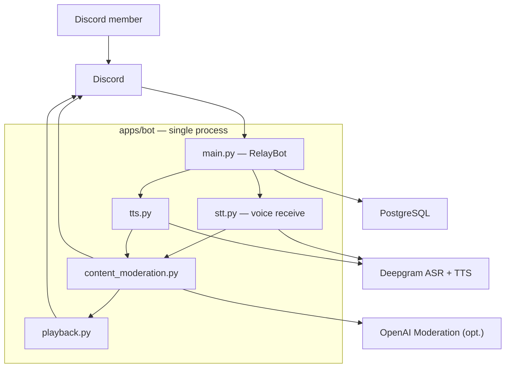
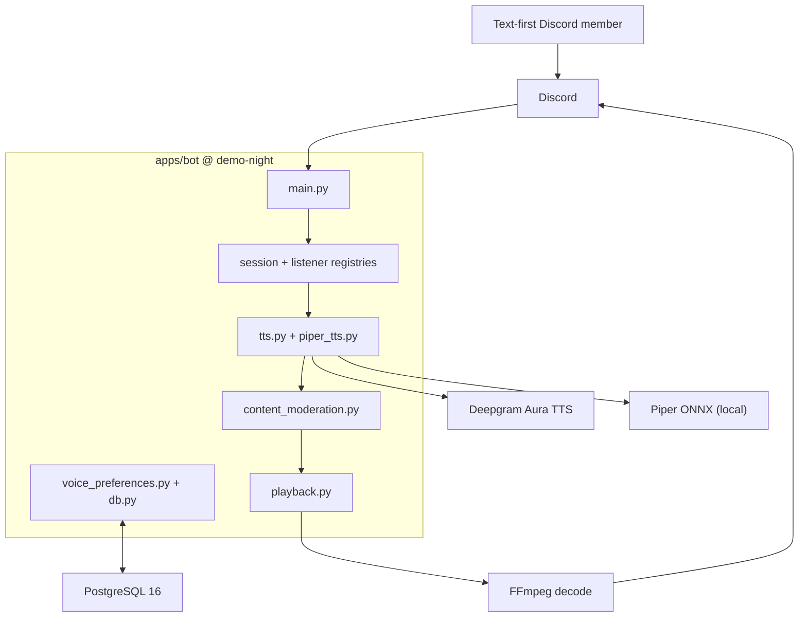

# Final Technical Report — TTSTT

**TTSTT · Noelle Evanich, Diego Silva, Dana Steinke · Spring 2026**

---

## 1. Product vision and evolution

Our original Week 2 product vision statement was long and complex, as we were trying to address all possible users of our product (Deaf/hard-of-hearing users + non-verbal/text-first users). Our scope was also too broad because we initially planned on providing neural Text-To-Speech to read aloud typed chat in voice channels, and Whisper-class ASR that would transcribe voice back to text, within a single product. ([`docs/product-vision.md`](docs/product-vision.md), commit [`8c26284`](https://github.com/CSEN-SCU/csen-174-s26-team-project-ttstt/commit/8c26284)).

Our new product vision statement shifted to text → speech only (selected users' messages are synthesized with per-user voices and played in the voice channel). We removed speech-to-text (voice receive, ASR, transcript posting, and `/stt_*` commands) because that was out of scope for this quarter-long project and allowed us to focus on one main user story, but it can potentially be reintroduced to implement bidirectional bridging. ([`docs/product-vision.md` § Scope note](docs/product-vision.md)).

### Four decisions that bent the vision

| # | Decision | Trigger | Repo artifact |
|---|----------|---------|---------------|
| 1 | **Cut STT from the deployable bot** | Deepgram STT worked in our prototypes, but rearranging Discord UDP packets for reliable utterance capture blocked consolidation ([`docs/sprint-2-retro.md`](docs/sprint-2-retro.md)) | STT removed in [`ac70a88`](https://github.com/CSEN-SCU/csen-174-s26-team-project-ttstt/commit/ac70a88) (`apps/bot/stt.py` deleted) |
| 2 | **Narrow our primary persona to text-first / non-verbal user** | The STT cut as described above removed the caption path for Deaf/HoH users. Our vision narrative was updated accordingly | [`docs/architechture-retrospective.md` § What has Changed](docs/architechture-retrospective.md) |
| 3 | **Add content moderation on the TTS hot path** | Peer red-team role-play of crisis disclosures and harmful relay ([Finding 3.1](docs/red-team-report-ttstt-received.md)) | [`apps/bot/content_moderation.py`](apps/bot/content_moderation.py), merged in [PR #25](https://github.com/CSEN-SCU/csen-174-s26-team-project-ttstt/pull/25) |
| 4 | **Add self-hosted Piper alongside Deepgram** | Sprint 3 commitment for lower latency and operator control without metered cloud TTS | [`apps/bot/piper_tts.py`](apps/bot/piper_tts.py), [`09d68b1`](https://github.com/CSEN-SCU/csen-174-s26-team-project-ttstt/commit/09d68b1) |

### Persona artifact

Our W2 vision narrative centers **Morgan**, a text-first study-group member who types in `#general` while their friends hang in voice. Their lines never reach listeners unless someone manually reads aloud ([`docs/product-vision.md` § 1b](docs/product-vision.md)). TTSTT still serves Morgan with `/tts_listen_user` + per-user synthetic voice closes the text→voice gap. However, the W2 caption persona (Deaf/HoH member needing voice→text) is **not served** by the bot. We documented that trade explicitly in [`docs/ethics-reflection.md`](docs/ethics-reflection.md) stakeholder analysis and [`docs/architechture-retrospective.md`](docs/architechture-retrospective.md).

**Repo reference:** [`docs/product-vision.md`](docs/product-vision.md) · [Sprint board](https://github.com/orgs/CSEN-SCU/projects/4)

---

## 2. Architecture evolution (W4 → W8 → current)

### W4: initial target (four containers, bidirectional)

From [`architecture/architecture.md`](architecture/architecture.md): During Week 4, we had Discord Bot + Companion API + Audio Processing + Postgres, with Whisper-class ASR and Piper-class TTS behind vendor-agnostic interfaces.

### W8: consolidated monolith + moderation (still bidirectional on paper)

After Sprint 1–2 consolidation into [`apps/bot`](apps/bot), we collapsed containers into one Python process, wired Deepgram for both ASR and TTS for further consolidation and consistency, and added moderation before any relay (based on red-team report feedback). This was driven by [PR #25](https://github.com/CSEN-SCU/csen-174-s26-team-project-ttstt/pull/25) and documented in [`docs/architechture-retrospective.md`](docs/architechture-retrospective.md) ([PR #26](https://github.com/CSEN-SCU/csen-174-s26-team-project-ttstt/pull/26)).

### Current: TTS-only at code freeze (`demo-night` tag)

The main change was that STT was removed in [`ac70a88`](https://github.com/CSEN-SCU/csen-174-s26-team-project-ttstt/commit/ac70a88) due to scope narrowing. Piper was also added in Sprint 3 for lower latency. Full as-built C4 in [`docs/architechture-retrospective.md`](docs/architechture-retrospective.md).

### Key architectural changes

| Transition | What changed | Trigger | Repo link |
|------------|--------------|---------|-----------|
| W4 → W8 | We planned four separate pieces (bot, API, audio processing, Postgres), but merged them into a single `apps/bot` process. We also implemented Deepgram instead of the Piper/Whisper stack we had originally planned. | We needed a working bot sooner than we could split out a Companion API, so we consolidated the prototypes first. | [`apps/bot/main.py`](apps/bot/main.py) |
| W8 → W8+ | We added a moderation step before anything gets read aloud—on both the TTS path and, at the time, STT. | The peer red-team review showed we could not safely relay chat or voice content without screening first (Findings 2.2 and 3.1). | [PR #25](https://github.com/CSEN-SCU/csen-174-s26-team-project-ttstt/pull/25), [`content_moderation.py`](apps/bot/content_moderation.py) |
| W8 → current | We removed speech-to-text entirely. The bot joins voice only to play audio back. It no longer listens to or transcribes what people say. | Capturing and decoding Discord voice packets reliably turned out to be much harder than we expected, and we chose to ship one solid user story before demo night. | [`ac70a88`](https://github.com/CSEN-SCU/csen-174-s26-team-project-ttstt/commit/ac70a88) |
| W8 → current | We added a second TTS option: self-hosted Piper alongside Deepgram, so users and operators are not locked to one provider. | Sprint 3 board ([#31](https://github.com/orgs/CSEN-SCU/projects/4?pane=issue&itemId=190647187)): Lower latency, more voice choice, and a path that does not depend on metered cloud TTS. | [`voice_preferences.py`](apps/bot/voice_preferences.py), [`09d68b1`](https://github.com/CSEN-SCU/csen-174-s26-team-project-ttstt/commit/09d68b1) |

**Three code paths implementing architectural decisions:**

1. **Text to voice:** When someone posts in the control channel, [`main.py`](apps/bot/main.py) runs the message through `moderate_for_tts()`, then `synthesize_text()`, then hands audio off to `PlaybackCoordinator`. It goes moderation first, speech second, then playback last.
2. **One line at a time per server:** [`GuildMessageSerializer`](apps/bot/main.py) queues TTS work so messages in the same guild do not talk over each other because without that, overlapping synthesis would make live hangs hard to follow and listen.
3. **Switching TTS providers cleanly:** When a user moves between Deepgram and Piper, [`apply_tts_provider_switch()`](apps/bot/voice_preferences.py) clears voice IDs that do not apply to the new provider. We cover that behavior in [`unittests/test_tts_provider_switch.py`](unittests/test_tts_provider_switch.py).

**Repo reference:** [`architecture/architecture.md`](architecture/architecture.md) · [`docs/architechture-retrospective.md`](docs/architechture-retrospective.md) · tag [`demo-night`](https://github.com/CSEN-SCU/csen-174-s26-team-project-ttstt/tree/demo-night) (`e76c197`)

---

## 3. Current state of the prototype

| Resource | Link |
|----------|------|
| **Add bot (live)** | https://discord.com/oauth2/authorize?client_id=1496265708215075016 |
| **Help guide** | https://kaleidoscopic-crostata-402ea4.netlify.app/ |
| **Demo video** | https://youtu.be/iY03F8pIJqQ |
| **Code freeze** | [`demo-night`](https://github.com/CSEN-SCU/csen-174-s26-team-project-ttstt/tree/demo-night) → `e76c197` |

### What TTSTT does today

- **Voice session control:** `/join`, `/leave`, and `/status`, tracked through [`SessionRegistry`](apps/bot/session_registry.py) in [`main.py`](apps/bot/main.py)
- **Selective TTS listen:** `/tts_listen_user` and the stop commands. Pick whose messages get read aloud via [`TtsListenerRegistry`](apps/bot/tts_listener_registry.py)
- **Per-user voice prefs (Postgres):** `/tts_voice_set`, `/tts_voice_show`, `/tts_voice_reset` saved per server in [`voice_preferences.py`](apps/bot/voice_preferences.py)
- **Dual TTS engines:** `/tts_provider_set` lets you choose Deepgram Aura or local Piper ([`tts.py`](apps/bot/tts.py), [`piper_tts.py`](apps/bot/piper_tts.py))
- **Content safety:** link blocking, sensitive-pattern checks, and optional OpenAI Moderation before anything is spoken ([`content_moderation.py`](apps/bot/content_moderation.py))
- **Sequential playback:** messages play in FIFO order, one guild at a time ([`playback.py`](apps/bot/playback.py))
- **Public help:** `/help` opens our Netlify guide ([`docs/help/index.html`](docs/help/index.html))

### What TTSTT does not do yet

- **Speech-to-text / live captions**: Removed ([`ac70a88`](https://github.com/CSEN-SCU/csen-174-s26-team-project-ttstt/commit/ac70a88))
- **Separate Companion API** from our Week 4 plan. The deployable bot is still one process
- **Per-user TTS rate limiting**: Flagged in red-team Finding 1.4 but we did not ship a follow-up for team velocity
- **Pronunciation control** beyond speed, pitch, and voice model selection

### Seams

- **Monolith:** all orchestration in one process. Simple to deploy, harder to scale TTS independently
- **Moderation:** heuristic + optional API. Not a full trust-and-safety pipeline ([`docs/architechture-retrospective.md` § Tech debt](docs/architechture-retrospective.md))
- **`architecture/architecture.md` still describes W4 target**; as-built diagrams live in [`docs/architechture-retrospective.md`](docs/architechture-retrospective.md)

**Repo reference:** [`apps/bot/README.md`](apps/bot/README.md) · [`docs/demo-video-script.md`](docs/demo-video-script.md)

---

## 4. Engineering process: testing, security, deployment

### Testing

| | Planned (W5) | Implemented |
|---|-------------|-------------|
| **Strategy** | Red-green TDD on transcription and voice-connection seams ([`docs/sprint-1-testing.md`](docs/sprint-1-testing.md)) | 22 unit test modules under [`unittests/`](unittests/); CI runs full suite on every PR |
| **Chose to test** | The logic we could isolate without Discord running such as who gets queued for TTS, what moderation allows through, playback order, provider switches, and the ethics rule that users can only stop listening to themselves | Examples in the repo: [`test_content_moderation.py`](unittests/test_content_moderation.py), [`test_playback_queue.py`](unittests/test_playback_queue.py), [`test_stop_listening_self_only.py`](unittests/test_stop_listening_self_only.py) |
| **Chose not to test** | Live Discord Gateway traffic, real UDP voice capture, and full end-to-end guild flows | We relied on manual testing in a real server instead; the only live Deepgram check is opt-in via `RUN_LIVE_DEEPGRAM_TEST=1` ([`test_tts_deepgram_live.py`](unittests/test_tts_deepgram_live.py)) |

**Methodical example:** When red-team Finding 3.1 flagged sensitive content being read aloud, we wrote [`test_tts_blocks_sensitive_and_urls`](unittests/test_content_moderation.py) first, then expanded the heuristics to make it pass. The test checks that self-harm phrasing and URLs get `Disposition.BLOCKED`, while normal chat stays `PUBLIC`. It still runs on every listened message through [`main.py`](apps/bot/main.py).

**AI vs. human:** Cursor helped us draft early pytest scaffolding and CI YAML ([`docs/sprint-1-retro.md`](docs/sprint-1-retro.md)). We fixed import paths (`apps.bot`), swapped brittle call-log checks for tests that assert behavior ([`docs/sprint-1-testing.md` § Before/After diff](docs/sprint-1-testing.md)), and chose which STT tests to drop once we cut speech-to-text ([`ac70a88`](https://github.com/CSEN-SCU/csen-174-s26-team-project-ttstt/commit/ac70a88)).

### Security

| | Planned (W7 audit scope) | Implemented |
|---|------------------------|-------------|
| **Strategy** | Peer red-team of public repo + Discord runtime ([`docs/red-team-report-ttstt-received.md`](docs/red-team-report-ttstt-received.md)) | Remediated two **Major** AI-safety findings on consolidated bot; documented response in [`docs/sprint-2-remediations.md`](docs/sprint-2-remediations.md) |
| **Finding → fix** | **3.1** Sensitive voice disclosures relayed publicly | `moderate_for_tts()` blocks sensitive text and URLs before synthesis; `/join` privacy notice |
| **Finding → fix** | **2.2** Unmoderated transcript relay | Ported to TTS path (STT removed); same module handles both dispositions |
| **Accepted risk** | **1.1** Unversioned git dependency | Resolved by removing `discord-ext-voice-recv` with STT cut ([`ac70a88`](https://github.com/CSEN-SCU/csen-174-s26-team-project-ttstt/commit/ac70a88)) |
| **Accepted risk** | **1.4** No TTS rate limit | Documented; not shipped before freeze |

**AI vs. human:** AI gave us a starting list of generic moderation patterns. We chose which crisis keywords to block, including phrasing that should route people toward 988 hotline, and, after our ethics review, limited `/tts_stop_listening` so users can only stop the bot from listening to themselves ([`0dc3581`](https://github.com/CSEN-SCU/csen-174-s26-team-project-ttstt/commit/0dc3581), [`docs/ethics-reflection.md`](docs/ethics-reflection.md)). We also kept the fixes in `apps/bot` instead of going back to patch old prototype folders.

### Deployment

| | Planned (W6) | Implemented |
|---|-------------|-------------|
| **Strategy** | GitHub Actions CI on PRs; Discord as product surface ([`docs/sprint-1-cicd.md`](docs/sprint-1-cicd.md)) | [`.github/workflows/ci.yml`](.github/workflows/ci.yml): checkout → Python 3.11 → `pip install -r apps/bot/requirements.txt` → `pytest unittests` |
| **Bot hosting** | Self-hosted Docker | [`apps/bot/Dockerfile`](apps/bot/Dockerfile); bot runs on team VPS with `.env` secrets |
| **Help site** | Public operator docs | Netlify static publish of [`docs/help/`](docs/help/) via [`netlify.toml`](netlify.toml) ([PR #29](https://github.com/CSEN-SCU/csen-174-s26-team-project-ttstt/pull/29)) |
| **Secrets** | Never in repo | [`apps/bot/.env.example`](apps/bot/.env.example); CI secret scoped to pytest step only (Finding 1.2 fix) |

**Pipeline stages on every PR to `main`:** checkout, Python setup, dependency install, full unit test suite.

**Repo reference:** [`.github/workflows/ci.yml`](.github/workflows/ci.yml) · [PR #25](https://github.com/CSEN-SCU/csen-174-s26-team-project-ttstt/pull/25) · [`docs/sprint-1-cicd.md`](docs/sprint-1-cicd.md)

---

## 5. Successes, setbacks, and AI tools

### Successes

1. **Red-team findings → shipped moderation in one sprint.** SmartShop's Finding 3.1 role-play had crisis language spoken in voice that would get relayed to the whole guild. We wrote failing tests for that scenario first, then merged [`content_moderation.py`](apps/bot/content_moderation.py) in [PR #25](https://github.com/CSEN-SCU/csen-174-s26-team-project-ttstt/pull/25) the same sprint. It worked because the harm case was concrete, not abstract. **Practice to keep:** turn peer review scenarios into failing tests before writing fixes.

2. **Three prototypes became one deployable bot.** We were building in parallel under `prototypes/`; Sprint 2 pulled that into [`apps/bot`](apps/bot) with Postgres-backed voice prefs and a single slash-command surface. It worked because we stopped maintaining forked bot copies and pointed fixes at one tree. **Practice to keep:** one `main.py` entrypoint and small registries (`SessionRegistry`, `TtsListenerRegistry`) instead of another prototype folder.

3. **Dual TTS landed in Sprint 3.** `/tts_provider_set` lets users switch between Deepgram Aura and self-hosted Piper, with voice IDs reset when the provider changes ([`09d68b1`](https://github.com/CSEN-SCU/csen-174-s26-team-project-ttstt/commit/09d68b1)): the commitment from our Sprint 2 retro. It worked because provider logic lives in [`tts.py`](apps/bot/tts.py) and [`piper_tts.py`](apps/bot/piper_tts.py), not scattered through Discord handlers. **Practice to keep:** that provider boundary when we add or swap engines.

### Setbacks

1. **STT blocked on Discord UDP packet handling.** Noelle integrated Deepgram ASR in prototype, but reliable utterance capture through `discord-ext-voice-recv` broke down when we merged into `apps/bot` ([`docs/sprint-2-retro.md`](docs/sprint-2-retro.md)). **Why it happened:** Discord's UDP voice path is finicky, and our prototype only proved STT in a narrow single-guild setup. **Missed signal:** it failed under multi-speaker load long before demo night, but we kept debugging instead of cutting scope. **Would do differently:** time-box a UDP ingress spike in Sprint 1 before committing to bidirectional TTS+STT in the vision. **Visible in:** STT work [`3b4c947`](https://github.com/CSEN-SCU/csen-174-s26-team-project-ttstt/commit/3b4c947) → removal [`ac70a88`](https://github.com/CSEN-SCU/csen-174-s26-team-project-ttstt/commit/ac70a88).

2. **Sprint 1 Kanban listed work we could not start yet.** Cards jumped ahead of working CI and test seams ([`docs/sprint-1-retro.md`](docs/sprint-1-retro.md)). **Why it happened:** we planned the quarter on the board before the groundwork was green. **Missed signal:** half the board stayed "In Progress" while one member was blocked on Discord voice intents and the rest could not land their pieces. **Would do differently:** cap cards to one lab's worth of work with a named assignee on each ([Sprint 2 commitment](https://github.com/orgs/CSEN-SCU/projects/4/views/1?pane=issue&itemId=186839589)).

3. **TTS rate limiting never shipped.** Red-team Finding 1.4 flagged unbounded queue abuse; our Sprint 2 retro still listed cooldown work as in progress ([`docs/sprint-2-retro.md`](docs/sprint-2-retro.md)). **Why it happened:** Piper and voice prefs pulled Sprint 3 focus, and rate limiting never got a card to "Done" with a failing test behind it. **Missed signal:** we talked about Finding 1.4 in retro notes but did not treat "no failing cooldown test" as a stop-ship for freeze. **Would do differently:** keep one red-team follow-up card on the board with an explicit definition of done before picking up new features. **Visible in:** open follow-up on the [Sprint board](https://github.com/orgs/CSEN-SCU/projects/4).

### AI tools across the quarter

Cursor helped early when we needed repeatable checks fast as it drafted pytest scaffolding in files like `unittests/test_bot_runtime_config_and_sync.py` and the first pass at [`.github/workflows/ci.yml`](.github/workflows/ci.yml) ([`docs/sprint-1-retro.md`](docs/sprint-1-retro.md)). We had to override it whenever output looked plausible but was not correct: wrong `apps.bot` import paths, brittle call-order assertions we replaced with behavior checks ([`docs/sprint-1-testing.md`](docs/sprint-1-testing.md)), and CI YAML that failed until we fixed env vars and test paths. The biggest unwind came in Sprint 2, when AI-assisted consolidation kept STT in the monolith while we burned a week on UDP debugging, but we deleted 700+ lines of STT code in [`ac70a88`](https://github.com/CSEN-SCU/csen-174-s26-team-project-ttstt/commit/ac70a88) rather than ship a flaky caption feature for demo night.

**Repo reference:** [`docs/sprint-1-retro.md`](docs/sprint-1-retro.md) · [`docs/sprint-2-retro.md`](docs/sprint-2-retro.md) · [Sprint board](https://github.com/orgs/CSEN-SCU/projects/4)

---

## 6. Future work

| Priority | Item | Why | Effort |
|----------|------|-----|--------|
| 1 | **Re-evaluate STT with a bounded spike** | Restores caption persona from W2; blocked once on UDP, not proven impossible | Sprint (research) |
| 2 | **TTS rate limiting + queue caps** | Closes red-team Finding 1.4; protects API quota in public guilds | Week |
| 3 | **Extract Companion API** | W4 separation of config/state from bot process; enables multi-bot scaling | Sprint |
| 4 | **Pronunciation / SSML hints** | Ethics reflection harm #1—users cannot fix mispronounced names | Week |
| 5 | **Full trust-and-safety pipeline** | Heuristic moderation misses edge cases; needs human review queue | Sprint+ (research) |

Items 1 and 5 are **research problems** (Discord voice receive semantics, moderation at scale). Items 2–4 are **next-sprint** engineering if the course continued.

**Repo reference:** [`docs/architechture-retrospective.md` § With another sprint](docs/architechture-retrospective.md) · [`docs/ethics-reflection.md`](docs/ethics-reflection.md)

---

## 7. Advice to future CSEN 174 teams

1. When peer review gives you a concrete harm scenario, write the failing test first as Finding 3.1 became [`test_tts_blocks_sensitive_and_urls`](unittests/test_content_moderation.py) before we grew [`content_moderation.py`](apps/bot/content_moderation.py), and that kept the fix small.
2. If a spike fails, cut scope in writing in the same commit you delete the code, as we only made the STT removal stick because we updated [`docs/product-vision.md`](docs/product-vision.md) and the architecture retrospective alongside deleting `stt.py`.
3. Do not trust AI-generated tests or CI until green runs on GitHub, as our Sprint 1 workflow looked fine on paper until someone fixed `apps.bot` imports and scoped secrets to the pytest step.

---
