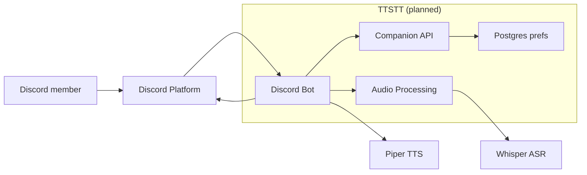
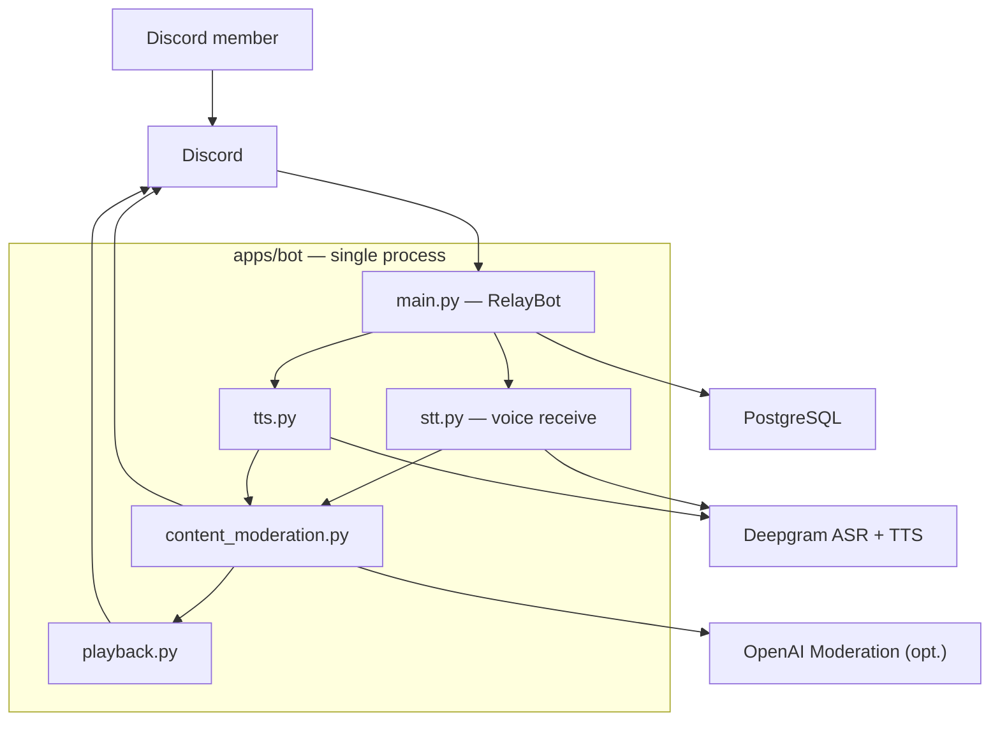
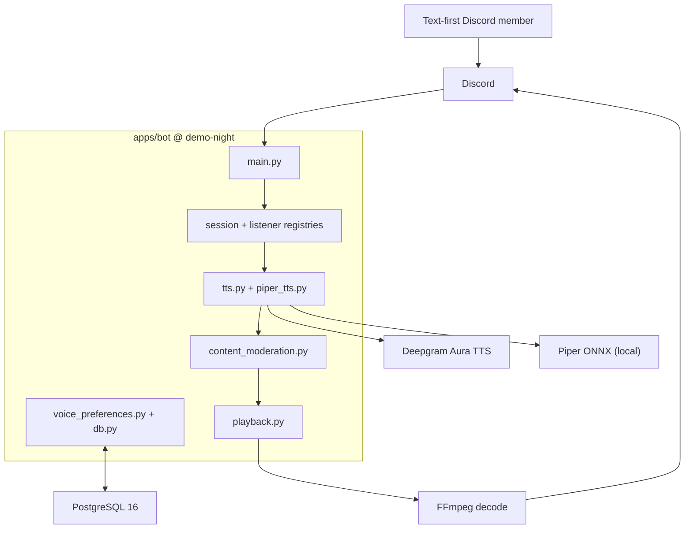

# Final Technical Report — TTSTT

**TTSTT · Noelle Evanich, Diego Silva, Dana Steinke · Spring 2026**

---

## 1. Product vision and evolution

**Original (W2).** TTSTT was conceived as a **bidirectional Discord bridge**: neural TTS would read typed chat aloud in voice channels, and Whisper-class ASR would transcribe voice back to text—serving non-verbal and text-first members *and* Deaf/hard-of-hearing users who need captions ([`docs/product-vision.md`](docs/product-vision.md), commit [`8c26284`](https://github.com/CSEN-SCU/csen-174-s26-team-project-ttstt/commit/8c26284)).

**Current (code freeze).** The deployable bot in [`apps/bot`](apps/bot) is **text → speech only**: selected users' messages are synthesized with per-user voices and played in the voice channel. Speech-to-text is explicitly out of scope until the team reopens bidirectional bridging ([`docs/product-vision.md` § Scope note](docs/product-vision.md)).

### Four decisions that bent the vision

| # | Decision | Trigger | Repo artifact |
|---|----------|---------|---------------|
| 1 | **Cut STT from the deployable bot** | Deepgram STT worked in prototype, but rearranging Discord UDP packets for reliable utterance capture blocked consolidation ([`docs/sprint-2-retro.md`](docs/sprint-2-retro.md)) | STT removed in [`ac70a88`](https://github.com/CSEN-SCU/csen-174-s26-team-project-ttstt/commit/ac70a88) (`apps/bot/stt.py` deleted) |
| 2 | **Narrow primary persona to text-first / non-verbal** | STT cut removed the caption path for Deaf/HoH users; vision narrative updated accordingly | [`docs/architechture-retrospective.md` § What has Changed](docs/architechture-retrospective.md) |
| 3 | **Add content moderation on the TTS hot path** | Peer red-team role-play of crisis disclosures and harmful relay ([Finding 3.1](docs/red-team-report-ttstt-received.md)) | [`apps/bot/content_moderation.py`](apps/bot/content_moderation.py), merged in [PR #25](https://github.com/CSEN-SCU/csen-174-s26-team-project-ttstt/pull/25) |
| 4 | **Add self-hosted Piper alongside Deepgram** | Sprint 3 commitment for lower latency and operator control without metered cloud TTS | [`apps/bot/piper_tts.py`](apps/bot/piper_tts.py), [`09d68b1`](https://github.com/CSEN-SCU/csen-174-s26-team-project-ttstt/commit/09d68b1) |

### Persona artifact

Our W2 vision narrative centers **Morgan**, a text-first study-group member who types in `#general` while friends hang in voice—their lines never reach listeners unless someone manually reads aloud ([`docs/product-vision.md` § 1b](docs/product-vision.md)). TTSTT still serves Morgan: `/tts_listen_user` + per-user synthetic voice closes the text→voice gap. The W2 caption persona (Deaf/HoH member needing voice→text) is **not served** by the frozen bot; we documented that trade explicitly in [`docs/ethics-reflection.md`](docs/ethics-reflection.md) stakeholder analysis and [`docs/architechture-retrospective.md`](docs/architechture-retrospective.md).

**Repo reference:** [`docs/product-vision.md`](docs/product-vision.md) · [Sprint board](https://github.com/orgs/CSEN-SCU/projects/4)

---

## 2. Architecture evolution (W4 → W8 → current)

### W4 — initial target (four containers, bidirectional)

From [`architecture/architecture.md`](architecture/architecture.md): Discord Bot + Companion API + Audio Processing + Postgres, with Whisper-class ASR and Piper-class TTS behind vendor-agnostic interfaces.

### W8 — consolidated monolith + moderation (still bidirectional on paper)

After Sprint 1–2 consolidation into [`apps/bot`](apps/bot), we collapsed containers into one Python process, wired Deepgram for both ASR and TTS, and added moderation before any relay—driven by [PR #25](https://github.com/CSEN-SCU/csen-174-s26-team-project-ttstt/pull/25) and documented in [`docs/architechture-retrospective.md`](docs/architechture-retrospective.md) ([PR #26](https://github.com/CSEN-SCU/csen-174-s26-team-project-ttstt/pull/26)).

### Current — TTS-only at code freeze (`demo-night` tag)

STT removed in [`ac70a88`](https://github.com/CSEN-SCU/csen-174-s26-team-project-ttstt/commit/ac70a88). Piper added in Sprint 3. Full as-built C4 in [`docs/architechture-retrospective.md`](docs/architechture-retrospective.md).

### Key architectural changes

| Transition | What changed | Trigger | Repo link |
|------------|--------------|---------|-----------|
| W4 → W8 | Four containers → monolith; Deepgram replaces Piper/Whisper in practice | Team velocity; prototypes merged before API split | [`apps/bot/main.py`](apps/bot/main.py) |
| W8 → W8+ | Moderation module on TTS (and STT) paths | Red-team Findings 2.2, 3.1 | [PR #25](https://github.com/CSEN-SCU/csen-174-s26-team-project-ttstt/pull/25), [`content_moderation.py`](apps/bot/content_moderation.py) |
| W8 → current | STT path deleted; playback-only voice client | UDP/voice-recv complexity vs. demo deadline | [`ac70a88`](https://github.com/CSEN-SCU/csen-174-s26-team-project-ttstt/commit/ac70a88) |
| W8 → current | Dual TTS providers (Deepgram + Piper) | Sprint 3 board [#31](https://github.com/orgs/CSEN-SCU/projects/4?pane=issue&itemId=190647187) | [`voice_preferences.py`](apps/bot/voice_preferences.py), [`09d68b1`](https://github.com/CSEN-SCU/csen-174-s26-team-project-ttstt/commit/09d68b1) |

**Three code paths implementing architectural decisions:**

1. **Message → TTS pipeline:** [`apps/bot/main.py`](apps/bot/main.py) `on_message` → `moderate_for_tts()` → `synthesize_text()` → `PlaybackCoordinator`
2. **Per-guild serialization:** [`GuildMessageSerializer`](apps/bot/main.py) prevents overlapping TTS work per guild (latency-sensitive queue semantics)
3. **Provider switch without stale voice IDs:** [`apply_tts_provider_switch()`](apps/bot/voice_preferences.py) in [`unittests/test_tts_provider_switch.py`](unittests/test_tts_provider_switch.py)

**Repo reference:** [`architecture/architecture.md`](architecture/architecture.md) · [`docs/architechture-retrospective.md`](docs/architechture-retrospective.md) · tag [`demo-night`](https://github.com/CSEN-SCU/csen-174-s26-team-project-ttstt/tree/demo-night) (`e76c197`)

---

## 3. Current state of the prototype

| Resource | Link |
|----------|------|
| **Add bot (live)** | https://discord.com/oauth2/authorize?client_id=1496265708215075016 |
| **Help guide** | https://kaleidoscopic-crostata-402ea4.netlify.app/ |
| **Demo video** | https://youtu.be/iY03F8pIJqQ |
| **Code freeze** | [`demo-night`](https://github.com/CSEN-SCU/csen-174-s26-team-project-ttstt/tree/demo-night) → `e76c197` |

### What it does

- **Voice session control** — `/join`, `/leave`, `/status` via [`SessionRegistry`](apps/bot/session_registry.py) in [`main.py`](apps/bot/main.py)
- **Selective TTS listen** — `/tts_listen_user`, stop variants via [`TtsListenerRegistry`](apps/bot/tts_listener_registry.py)
- **Per-user voice prefs (Postgres)** — `/tts_voice_set`, `/tts_voice_show`, `/tts_voice_reset` via [`voice_preferences.py`](apps/bot/voice_preferences.py)
- **Dual TTS engines** — `/tts_provider_set` chooses Deepgram Aura or local Piper ([`tts.py`](apps/bot/tts.py), [`piper_tts.py`](apps/bot/piper_tts.py))
- **Content safety** — link blocking, sensitive-pattern heuristics, optional OpenAI Moderation ([`content_moderation.py`](apps/bot/content_moderation.py))
- **Sequential playback** — FIFO per-guild queue ([`playback.py`](apps/bot/playback.py))
- **Public help** — `/help` → Netlify static site ([`docs/help/index.html`](docs/help/index.html))

### What it does not do yet

- Speech-to-text / live captions (removed; see [`ac70a88`](https://github.com/CSEN-SCU/csen-174-s26-team-project-ttstt/commit/ac70a88))
- Separate Companion API container from W4 plan
- Per-user TTS rate limiting (flagged in red-team Finding 1.4; follow-up not shipped)
- Pronunciation control beyond speed/pitch/voice model selection

### Seams

- **Monolith:** all orchestration in one process—simple to deploy, harder to scale TTS independently
- **Moderation:** heuristic + optional API—not a full trust-and-safety pipeline ([`docs/architechture-retrospective.md` § Tech debt](docs/architechture-retrospective.md))
- **`architecture/architecture.md` still describes W4 target**; as-built diagrams live in [`docs/architechture-retrospective.md`](docs/architechture-retrospective.md)

**Repo reference:** [`apps/bot/README.md`](apps/bot/README.md) · [`docs/demo-video-script.md`](docs/demo-video-script.md)

---

## 4. Engineering process: testing, security, deployment

### Testing

| | Planned (W5) | Implemented |
|---|-------------|-------------|
| **Strategy** | Red-green TDD on transcription and voice-connection seams ([`docs/sprint-1-testing.md`](docs/sprint-1-testing.md)) | 22 unit test modules under [`unittests/`](unittests/); CI runs full suite on every PR |
| **Chose to test** | Domain contracts: enqueue rules, moderation dispositions, playback FIFO, provider switches, ethics-driven self-only stop | Representative: [`test_content_moderation.py`](unittests/test_content_moderation.py), [`test_playback_queue.py`](unittests/test_playback_queue.py), [`test_stop_listening_self_only.py`](unittests/test_stop_listening_self_only.py) |
| **Chose not to test** | Live Discord Gateway, real UDP voice receive, end-to-end guild flows | Deferred to manual guild testing; live Deepgram test gated behind `RUN_LIVE_DEEPGRAM_TEST=1` ([`test_tts_deepgram_live.py`](unittests/test_tts_deepgram_live.py)) |

**Methodical example:** After red-team Finding 3.1, we wrote [`test_tts_blocks_sensitive_and_urls`](unittests/test_content_moderation.py) *before* expanding heuristics—asserting `Disposition.BLOCKED` for self-harm phrasing and URLs, `PUBLIC` for benign chat. That test still guards the hot path called from [`main.py`](apps/bot/main.py) on every listened message.

**AI vs. human:** Cursor drafted initial pytest scaffolding and CI YAML ([`docs/sprint-1-retro.md`](docs/sprint-1-retro.md)); humans fixed import paths (`apps.bot`), removed brittle call-log assertions in favor of behavior contracts ([`docs/sprint-1-testing.md` § Before/After diff](docs/sprint-1-testing.md)), and decided which STT tests to retire when STT was cut ([`ac70a88`](https://github.com/CSEN-SCU/csen-174-s26-team-project-ttstt/commit/ac70a88)).

### Security

| | Planned (W7 audit scope) | Implemented |
|---|------------------------|-------------|
| **Strategy** | Peer red-team of public repo + Discord runtime ([`docs/red-team-report-ttstt-received.md`](docs/red-team-report-ttstt-received.md)) | Remediated two **Major** AI-safety findings on consolidated bot; documented response in [`docs/sprint-2-remediations.md`](docs/sprint-2-remediations.md) |
| **Finding → fix** | **3.1** Sensitive voice disclosures relayed publicly | `moderate_for_tts()` blocks sensitive text and URLs before synthesis; `/join` privacy notice |
| **Finding → fix** | **2.2** Unmoderated transcript relay | Ported to TTS path (STT removed); same module handles both dispositions |
| **Accepted risk** | **1.1** Unversioned git dependency | Resolved by removing `discord-ext-voice-recv` with STT cut ([`ac70a88`](https://github.com/CSEN-SCU/csen-174-s26-team-project-ttstt/commit/ac70a88)) |
| **Accepted risk** | **1.4** No TTS rate limit | Documented; not shipped before freeze |

**AI vs. human:** AI suggested generic moderation patterns; humans selected crisis keywords (988 routing intent), decided `/tts_stop_listening` must be self-only per ethics review ([`0dc3581`](https://github.com/CSEN-SCU/csen-174-s26-team-project-ttstt/commit/0dc3581), [`docs/ethics-reflection.md`](docs/ethics-reflection.md)), and scoped fixes to `apps/bot` rather than reopening prototype trees.

### Deployment

| | Planned (W6) | Implemented |
|---|-------------|-------------|
| **Strategy** | GitHub Actions CI on PRs; Discord as product surface ([`docs/sprint-1-cicd.md`](docs/sprint-1-cicd.md)) | [`.github/workflows/ci.yml`](.github/workflows/ci.yml): checkout → Python 3.11 → `pip install -r apps/bot/requirements.txt` → `pytest unittests` |
| **Bot hosting** | Self-hosted Docker | [`apps/bot/Dockerfile`](apps/bot/Dockerfile); bot runs on team VPS with `.env` secrets |
| **Help site** | Public operator docs | Netlify static publish of [`docs/help/`](docs/help/) via [`netlify.toml`](netlify.toml) ([PR #29](https://github.com/CSEN-SCU/csen-174-s26-team-project-ttstt/pull/29)) |
| **Secrets** | Never in repo | [`apps/bot/.env.example`](apps/bot/.env.example); CI secret scoped to pytest step only (Finding 1.2 fix) |

**Pipeline stages on every PR to `main`:** checkout, Python setup, dependency install, full unit test suite.

**Repo reference:** [`.github/workflows/ci.yml`](.github/workflows/ci.yml) · [PR #25](https://github.com/CSEN-SCU/csen-174-s26-team-project-ttstt/pull/25) · [`docs/sprint-1-cicd.md`](docs/sprint-1-cicd.md)

---

## 5. Successes, setbacks, and AI tools

### Successes

1. **Red-team findings → shipped moderation in one sprint.** SmartShop's Finding 3.1 role-play (self-harm spoken in VC) became [`content_moderation.py`](apps/bot/content_moderation.py) and tests in [PR #25](https://github.com/CSEN-SCU/csen-174-s26-team-project-ttstt/pull/25). *Keep:* translate peer review scenarios directly into failing tests before writing fixes.

2. **Consolidated deployable bot from three prototypes.** Per-member spikes under `prototypes/` merged into [`apps/bot`](apps/bot) with Postgres-backed prefs and a single command surface. *Keep:* one `main.py` entrypoint and explicit registries instead of parallel bot copies.

3. **Dual TTS providers landed Sprint 3.** `/tts_provider_set` switches Deepgram ↔ Piper with voice-ID reset logic ([`09d68b1`](https://github.com/CSEN-SCU/csen-174-s26-team-project-ttstt/commit/09d68b1)). *Keep:* provider interface in [`tts.py`](apps/bot/tts.py) so swapping engines does not touch Discord handlers.

### Setbacks

1. **STT blocked on Discord UDP packet handling.** Noelle integrated Deepgram ASR, but reliable utterance capture via `discord-ext-voice-recv` failed during consolidation ([`docs/sprint-2-retro.md`](docs/sprint-2-retro.md)). *Missed signal:* prototype STT worked in a narrow guild setup but not under multi-speaker load. *Would do differently:* spike UDP ingress limits in Sprint 1 before committing to bidirectional vision. *Visible in:* STT commits [`3b4c947`](https://github.com/CSEN-SCU/csen-174-s26-team-project-ttstt/commit/3b4c947) → removal [`ac70a88`](https://github.com/CSEN-SCU/csen-174-s26-team-project-ttstt/commit/ac70a88).

2. **Sprint 1 Kanban over-scoped.** Cards listed work too far ahead of working CI and test seams ([`docs/sprint-1-retro.md`](docs/sprint-1-retro.md)). *Missed signal:* half the board stayed "In Progress" while one member blocked on voice intents. *Would do differently:* cap cards to one lab's worth of work with mandatory assignees ([Sprint 2 commitment](https://github.com/orgs/CSEN-SCU/projects/4/views/1?pane=issue&itemId=186839589)).

3. **TTS rate limiting never shipped.** Red-team Finding 1.4 flagged unbounded queue abuse; Sprint 2 retro noted it still in progress ([`docs/sprint-2-retro.md`](docs/sprint-2-retro.md)). *Missed signal:* no board card reached "Done" with a failing test for cooldown. *Visible in:* open follow-up on [Sprint board #31 area](https://github.com/orgs/CSEN-SCU/projects/4).

### AI tools across the quarter

AI accelerated **CI scaffolding** and **first-draft tests** ([`docs/sprint-1-retro.md`](docs/sprint-1-retro.md)), but we had to **override** it when it generated plausible-but-wrong Discord intent assumptions and brittle call-order assertions ([`docs/sprint-1-testing.md`](docs/sprint-1-testing.md)). AI also proposed keeping STT in the monolith; humans **unwound** that path after a week of UDP debugging and explicitly deleted 700+ lines of STT code rather than shipping a flaky demo feature ([`ac70a88`](https://github.com/CSEN-SCU/csen-174-s26-team-project-ttstt/commit/ac70a88)).

**Repo reference:** [`docs/sprint-1-retro.md`](docs/sprint-1-retro.md) · [`docs/sprint-2-retro.md`](docs/sprint-2-retro.md) · [Sprint board](https://github.com/orgs/CSEN-SCU/projects/4)

---

## 6. Future work

| Priority | Item | Why | Effort |
|----------|------|-----|--------|
| 1 | **Re-evaluate STT with a bounded spike** | Restores caption persona from W2; blocked once on UDP, not proven impossible | Sprint (research) |
| 2 | **TTS rate limiting + queue caps** | Closes red-team Finding 1.4; protects API quota in public guilds | Week |
| 3 | **Extract Companion API** | W4 separation of config/state from bot process; enables multi-bot scaling | Sprint |
| 4 | **Pronunciation / SSML hints** | Ethics reflection harm #1—users cannot fix mispronounced names | Week |
| 5 | **Full trust-and-safety pipeline** | Heuristic moderation misses edge cases; needs human review queue | Sprint+ (research) |

Items 1 and 5 are **research problems** (Discord voice receive semantics, moderation at scale). Items 2–4 are **next-sprint** engineering if the course continued.

**Repo reference:** [`docs/architechture-retrospective.md` § With another sprint](docs/architechture-retrospective.md) · [`docs/ethics-reflection.md`](docs/ethics-reflection.md)

---

## 7. Advice to future CSEN 174 teams

1. **Write the failing test for your red-team scenario before the fix**—our moderation module stayed small because Finding 3.1 became [`test_tts_blocks_sensitive_and_urls`](unittests/test_content_moderation.py) first.
2. **Cut scope in writing when a spike fails**, not silently—deleting `stt.py` only worked because we updated [`docs/product-vision.md`](docs/product-vision.md) and the architecture retrospective in the same commit.
3. **Treat AI output as a draft until it runs in CI**—our Sprint 1 workflow looked correct until a human fixed imports and scoped secrets to the pytest step.

---
