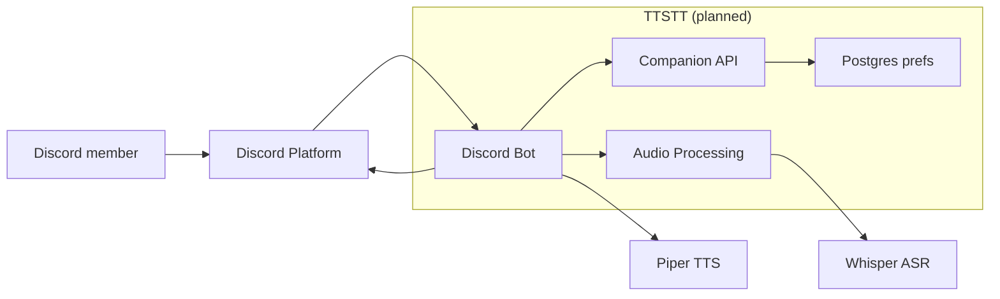
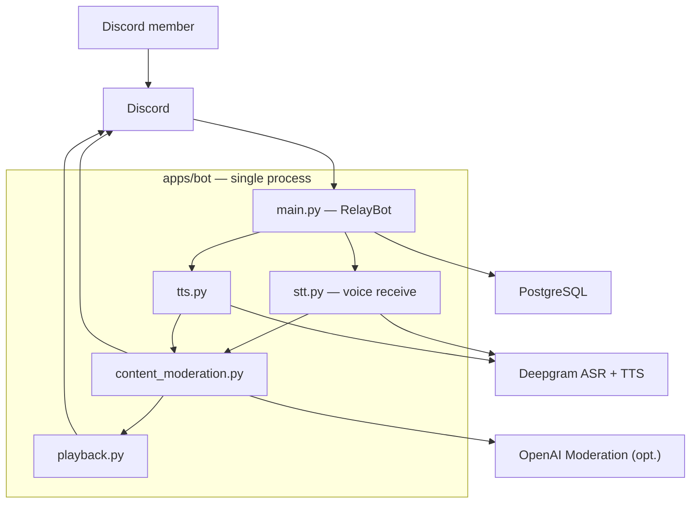
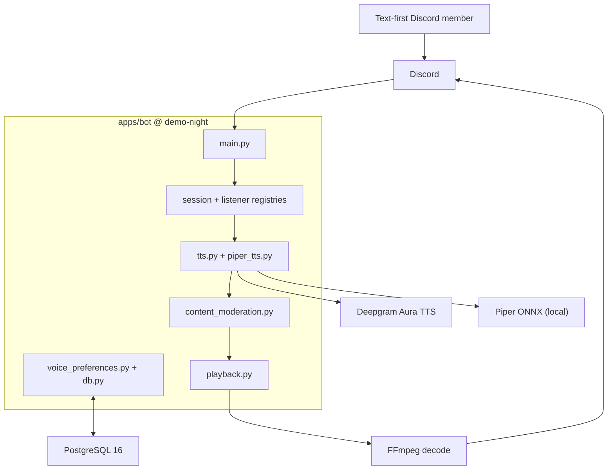

# Final Technical Report — TTSTT

**TTSTT · Noelle Evanich, Diego Silva, Dana Steinke · Spring 2026**

---

## 1. Product vision and evolution

Our Week 2 vision too long and muddled, as it served Deaf/HoH and non-verbal users with both TTS and Whisper-class ASR ([`docs/product-vision.md`](docs/product-vision.md), [`8c26284`](https://github.com/CSEN-SCU/csen-174-s26-team-project-ttstt/commit/8c26284)). We narrowed to **text → speech only**, per-user synthetic voice in channel, and cut STT to focus on one user story ([`docs/product-vision.md` § Scope note](docs/product-vision.md)).

### Four decisions that bent the vision

1. **Cut STT**: UDP utterance capture blocked consolidation ([`docs/sprint-2-retro.md`](docs/sprint-2-retro.md)) → [`ac70a88`](https://github.com/CSEN-SCU/csen-174-s26-team-project-ttstt/commit/ac70a88)
2. **Narrow persona to text-first / non-verbal**: STT cut removed Deaf/HoH caption path → [`docs/architechture-retrospective.md`](docs/architechture-retrospective.md)
3. **Moderation on TTS hot path**: Red-team Finding 3.1 (crisis disclosure, harmful relay) → [`content_moderation.py`](apps/bot/content_moderation.py), [PR #25](https://github.com/CSEN-SCU/csen-174-s26-team-project-ttstt/pull/25)
4. **Piper alongside Deepgram**: Sprint 3: lower latency, no metered TTS → [`piper_tts.py`](apps/bot/piper_tts.py), [`09d68b1`](https://github.com/CSEN-SCU/csen-174-s26-team-project-ttstt/commit/09d68b1)

### Persona artifact

Our W2 vision narrative centers **Morgan**, a text-first study-group member who types in `#general` while their friends hang in voice. Their lines never reach listeners unless someone manually reads aloud ([`docs/product-vision.md` § 1b](docs/product-vision.md)). TTSTT still serves Morgan with `/tts_listen_user` + per-user synthetic voice closes the text→voice gap. However, the W2 caption persona (Deaf/HoH member needing voice→text) is **not served** by the bot. We documented that trade explicitly in [`docs/ethics-reflection.md`](docs/ethics-reflection.md) stakeholder analysis and [`docs/architechture-retrospective.md`](docs/architechture-retrospective.md).

**Repo reference:** [`docs/product-vision.md`](docs/product-vision.md) · [Sprint board](https://github.com/orgs/CSEN-SCU/projects/4)

---

## 2. Architecture evolution (W4 → W8 → current)

### W4: initial target (four containers, bidirectional)

From [`architecture/architecture.md`](architecture/architecture.md): During Week 4, we had Discord Bot + Companion API + Audio Processing + Postgres, with Whisper-class ASR and Piper-class TTS behind vendor-agnostic interfaces.

### W8: consolidated monolith + moderation (still bidirectional on paper)

After Sprint 1–2 consolidation into [`apps/bot`](apps/bot), we collapsed containers into one Python process, wired Deepgram for both ASR and TTS for further consolidation and consistency, and added moderation before any relay. Driven by [PR #25](https://github.com/CSEN-SCU/csen-174-s26-team-project-ttstt/pull/25) and documented in [`docs/architechture-retrospective.md`](docs/architechture-retrospective.md) ([PR #26](https://github.com/CSEN-SCU/csen-174-s26-team-project-ttstt/pull/26)).

### Current: TTS-only at code freeze (`demo-night` tag)

STT was removed in [`ac70a88`](https://github.com/CSEN-SCU/csen-174-s26-team-project-ttstt/commit/ac70a88) due to scope narrowing. Piper was also added in Sprint 3 for lower latency. Full as-built C4 in [`docs/architechture-retrospective.md`](docs/architechture-retrospective.md).

### Key architectural changes

| Transition | What changed | Trigger | Repo link |
|------------|--------------|---------|-----------|
| W4 → W8 | Four containers → monolith in `apps/bot`; Deepgram replaced Piper/Whisper | Prototypes merged before Companion API split | [`apps/bot/main.py`](apps/bot/main.py) |
| W8 → W8+ | Moderation before TTS (and STT at the time) | Red-team Findings 2.2, 3.1 | [PR #25](https://github.com/CSEN-SCU/csen-174-s26-team-project-ttstt/pull/25), [`content_moderation.py`](apps/bot/content_moderation.py) |
| W8 → current | STT removed; bot joins voice to play audio only | Discord UDP capture too hard; one user story for demo | [`ac70a88`](https://github.com/CSEN-SCU/csen-174-s26-team-project-ttstt/commit/ac70a88) |
| W8 → current | Piper added alongside Deepgram | Sprint 3 ([#31](https://github.com/orgs/CSEN-SCU/projects/4?pane=issue&itemId=190647187)): lower latency, less metered TTS | [`voice_preferences.py`](apps/bot/voice_preferences.py), [`09d68b1`](https://github.com/CSEN-SCU/csen-174-s26-team-project-ttstt/commit/09d68b1) |

**Three code paths implementing architectural decisions:**

1. **Text → voice:** `moderate_for_tts()` → `synthesize_text()` → playback ([`main.py`](apps/bot/main.py))
2. **Per-guild queue:** [`GuildMessageSerializer`](apps/bot/main.py) prevents overlapping TTS in one server
3. **Provider switch:** [`apply_tts_provider_switch()`](apps/bot/voice_preferences.py) clears stale voice IDs ([`test_tts_provider_switch.py`](unittests/test_tts_provider_switch.py))

**Repo reference:** [`architecture/architecture.md`](architecture/architecture.md) · [`docs/architechture-retrospective.md`](docs/architechture-retrospective.md) · tag [`demo-night`](https://github.com/CSEN-SCU/csen-174-s26-team-project-ttstt/tree/demo-night) (`e76c197`)

---

## 3. Current state of the prototype

| Resource | Link |
|----------|------|
| **Add bot (live)** | https://discord.com/oauth2/authorize?client_id=1496265708215075016 |
| **Help guide** | https://kaleidoscopic-crostata-402ea4.netlify.app/ |
| **Demo video** | https://youtu.be/iY03F8pIJqQ |
| **Code freeze** | [`demo-night`](https://github.com/CSEN-SCU/csen-174-s26-team-project-ttstt/tree/demo-night) → `e76c197` |

### What TTSTT does today

- **Voice session:** `/join`, `/leave`, `/status` ([`SessionRegistry`](apps/bot/session_registry.py))
- **TTS listen + prefs:** `/tts_listen_user`, `/tts_voice_*`, `/tts_provider_set` — Deepgram or Piper ([`TtsListenerRegistry`](apps/bot/tts_listener_registry.py), [`voice_preferences.py`](apps/bot/voice_preferences.py), [`tts.py`](apps/bot/tts.py), [`piper_tts.py`](apps/bot/piper_tts.py))
- **Safety + playback:** moderation, FIFO per guild ([`content_moderation.py`](apps/bot/content_moderation.py), [`playback.py`](apps/bot/playback.py))
- **Help:** `/help` → Netlify ([`docs/help/index.html`](docs/help/index.html))

### What TTSTT does not do yet

- **Speech-to-text / live captions**: Removed ([`ac70a88`](https://github.com/CSEN-SCU/csen-174-s26-team-project-ttstt/commit/ac70a88))
- **Separate Companion API** from our Week 4 plan. The deployable bot is still one process
- **Per-user TTS rate limiting**: Flagged in red-team Finding 1.4 but we did not ship a follow-up for team velocity
- **Pronunciation control** beyond speed, pitch, and voice model selection

### Seams

- **Monolith:** all orchestration in one process. Simple to deploy, harder to scale TTS independently
- **Moderation:** heuristic + optional API. Not a full trust-and-safety pipeline ([`docs/architechture-retrospective.md` § Tech debt](docs/architechture-retrospective.md))
- **`architecture/architecture.md` still describes W4 target**; as-built diagrams live in [`docs/architechture-retrospective.md`](docs/architechture-retrospective.md)

**Repo reference:** [`apps/bot/README.md`](apps/bot/README.md) · [`docs/demo-video-script.md`](docs/demo-video-script.md)

---

## 4. Engineering process: testing, security, deployment

### Testing

| | Planned (W5) | Implemented |
|---|-------------|-------------|
| **Strategy** | Red-green TDD on voice/transcription seams ([`docs/sprint-1-testing.md`](docs/sprint-1-testing.md)) | 22 modules in [`unittests/`](unittests/); CI on every PR |
| **Chose to test** | Queue, moderation, playback, provider switch, self-only stop | [`test_content_moderation.py`](unittests/test_content_moderation.py), [`test_playback_queue.py`](unittests/test_playback_queue.py), [`test_stop_listening_self_only.py`](unittests/test_stop_listening_self_only.py) |
| **Chose not to test** | Live Gateway, UDP voice, E2E guild | Manual guild testing; opt-in Deepgram (`RUN_LIVE_DEEPGRAM_TEST=1`) |

**Methodical example:** Finding 3.1 → [`test_tts_blocks_sensitive_and_urls`](unittests/test_content_moderation.py) before heuristics; blocks self-harm/URLs, allows normal chat ([`main.py`](apps/bot/main.py)).

**AI vs. human:** Cursor drafted pytest + CI ([`docs/sprint-1-retro.md`](docs/sprint-1-retro.md)); we fixed `apps.bot` imports, behavior-over-call-log tests ([`docs/sprint-1-testing.md`](docs/sprint-1-testing.md)), and retired STT tests ([`ac70a88`](https://github.com/CSEN-SCU/csen-174-s26-team-project-ttstt/commit/ac70a88)).

### Security

| | Planned (W7 audit scope) | Implemented |
|---|------------------------|-------------|
| **Strategy** | Peer red-team of public repo + Discord runtime ([`docs/red-team-report-ttstt-received.md`](docs/red-team-report-ttstt-received.md)) | Remediated two **Major** AI-safety findings on consolidated bot; documented response in [`docs/sprint-2-remediations.md`](docs/sprint-2-remediations.md) |
| **Finding → fix** | **3.1** Sensitive voice disclosures relayed publicly | `moderate_for_tts()` blocks sensitive text and URLs before synthesis; `/join` privacy notice |
| **Finding → fix** | **2.2** Unmoderated transcript relay | Ported to TTS path (STT removed); same module handles both dispositions |
| **Accepted risk** | **1.1** Unversioned git dependency | Resolved by removing `discord-ext-voice-recv` with STT cut ([`ac70a88`](https://github.com/CSEN-SCU/csen-174-s26-team-project-ttstt/commit/ac70a88)) |
| **Accepted risk** | **1.4** No TTS rate limit | Documented; not shipped before freeze |

**AI vs. human:** We trimmed AI’s generic moderation list to crisis keywords (988 intent), made `/tts_stop_listening` self-only after ethics review ([`0dc3581`](https://github.com/CSEN-SCU/csen-174-s26-team-project-ttstt/commit/0dc3581), [`docs/ethics-reflection.md`](docs/ethics-reflection.md)), and fixed `apps/bot` instead of old prototypes.

### Deployment

| | Planned (W6) | Implemented |
|---|-------------|-------------|
| **Strategy** | GitHub Actions CI on PRs; Discord as product surface ([`docs/sprint-1-cicd.md`](docs/sprint-1-cicd.md)) | [`.github/workflows/ci.yml`](.github/workflows/ci.yml): checkout → Python 3.11 → `pip install -r apps/bot/requirements.txt` → `pytest unittests` |
| **Bot hosting** | Self-hosted Docker | [`apps/bot/Dockerfile`](apps/bot/Dockerfile); bot runs on team VPS with `.env` secrets |
| **Help site** | Public operator docs | Netlify static publish of [`docs/help/`](docs/help/) via [`netlify.toml`](netlify.toml) ([PR #29](https://github.com/CSEN-SCU/csen-174-s26-team-project-ttstt/pull/29)) |
| **Secrets** | Never in repo | [`apps/bot/.env.example`](apps/bot/.env.example); CI secret scoped to pytest step only (Finding 1.2 fix) |

**Pipeline stages on every PR to `main`:** checkout, Python setup, dependency install, full unit test suite.

**Repo reference:** [`.github/workflows/ci.yml`](.github/workflows/ci.yml) · [PR #25](https://github.com/CSEN-SCU/csen-174-s26-team-project-ttstt/pull/25) · [`docs/sprint-1-cicd.md`](docs/sprint-1-cicd.md)

---

## 5. Successes, setbacks, and AI tools

### Successes

1. **Red-team → moderation in one sprint.** Finding 3.1 crisis role-play → failing tests → [PR #25](https://github.com/CSEN-SCU/csen-174-s26-team-project-ttstt/pull/25). Worked because the scenario was concrete. **Keep:** test the harm case first.
2. **Three prototypes → one bot.** Merged into [`apps/bot`](apps/bot). Worked because fixes stopped living in forked trees. **Keep:** one `main.py`.
3. **Dual TTS in Sprint 3.** `/tts_provider_set` ([`09d68b1`](https://github.com/CSEN-SCU/csen-174-s26-team-project-ttstt/commit/09d68b1)). Worked because engines sit in [`tts.py`](apps/bot/tts.py), not handlers. **Keep:** provider boundary.

### Setbacks

1. **STT blocked on UDP.** Deepgram ASR in prototype; `discord-ext-voice-recv` failed in consolidation ([`docs/sprint-2-retro.md`](docs/sprint-2-retro.md)). *Why:* finicky UDP; narrow demo. *Missed:* multi-speaker failure early. *Next time:* Sprint 1 spike. [`3b4c947`](https://github.com/CSEN-SCU/csen-174-s26-team-project-ttstt/commit/3b4c947) → [`ac70a88`](https://github.com/CSEN-SCU/csen-174-s26-team-project-ttstt/commit/ac70a88).
2. **Sprint 1 Kanban over-scoped.** Cards ahead of green CI ([`docs/sprint-1-retro.md`](docs/sprint-1-retro.md)). *Missed:* half the board stuck while one person blocked on voice intents. *Next time:* one lab per card ([Sprint 2 commitment](https://github.com/orgs/CSEN-SCU/projects/4/views/1?pane=issue&itemId=186839589)).
3. **TTS rate limiting not shipped.** Finding 1.4 open in Sprint 2 retro ([`docs/sprint-2-retro.md`](docs/sprint-2-retro.md)). *Missed:* no failing cooldown test. *Next time:* red-team card with definition of done. [Sprint board](https://github.com/orgs/CSEN-SCU/projects/4).

### AI collaboration across the quarter

Cursor sped up Sprint 1 pytest + CI ([`docs/sprint-1-retro.md`](docs/sprint-1-retro.md), [`.github/workflows/ci.yml`](.github/workflows/ci.yml)) but gave us wrong `apps.bot` imports, brittle call-log tests ([`docs/sprint-1-testing.md`](docs/sprint-1-testing.md)), and a week of STT/UDP debugging before we deleted 700+ lines ([`ac70a88`](https://github.com/CSEN-SCU/csen-174-s26-team-project-ttstt/commit/ac70a88)). On security, we overrode generic AI blocklists with crisis keywords (988 intent) and self-only `/tts_stop_listening` ([`0dc3581`](https://github.com/CSEN-SCU/csen-174-s26-team-project-ttstt/commit/0dc3581), [`docs/ethics-reflection.md`](docs/ethics-reflection.md)).

## 6. Future work

1. **STT bounded spike** *(Sprint, research)* — restore W2 caption persona; UDP blocked us once, not proven impossible.
2. **TTS rate limiting + queue caps** *(Week)* — close Finding 1.4; protect API quota in public guilds.
3. **Companion API** *(Sprint)* — W4 config/state split; multi-bot scaling.
4. **Pronunciation / SSML** *(Week)* — ethics harm #1: mispronounced names.
5. **Trust-and-safety pipeline** *(Sprint+, research)* — heuristics miss edge cases; needs human review.

**Repo reference:** [`docs/architechture-retrospective.md` § With another sprint](docs/architechture-retrospective.md) · [`docs/ethics-reflection.md`](docs/ethics-reflection.md)

---

## 7. Advice to future CSEN 174 teams

1. Write the failing test for your red-team scenario first as Finding 3.1 → [`test_tts_blocks_sensitive_and_urls`](unittests/test_content_moderation.py) kept moderation small.
2. Cut scope in writing in the same commit you delete code, as we updated [`docs/product-vision.md`](docs/product-vision.md) when we removed `stt.py`.
3. Treat AI output as draft until CI is green, as we fixed imports after Sprint 1 YAML looked done.
