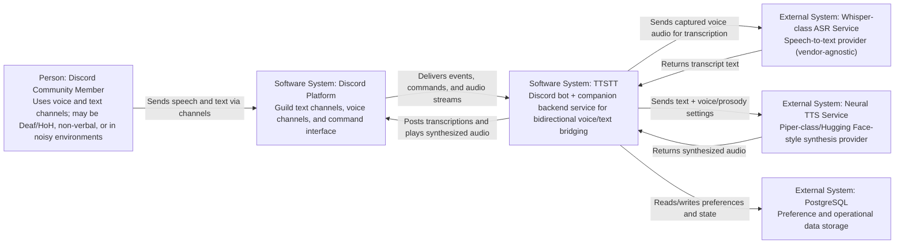
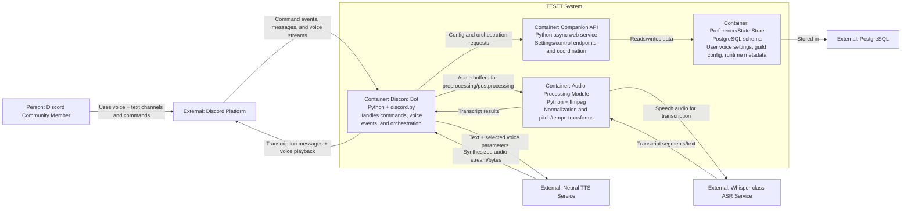

# TTSTT Architecture (Consolidation Plan + C4 Diagrams)

This document is the team’s living architecture reference for the planned TTSTT system.  
TTSTT is a Discord-first product that bridges voice and text in both directions:

- Speech in voice channels is transcribed to posted text (ASR).
- Text messages are synthesized into playable voice audio (TTS).
- Per-user and per-server preferences are stored in Postgres.
- Optional server-side audio processing normalizes output for clearer playback.

## Consolidated stack

- Front end / primary UX: Discord slash/chat commands (no separate required web UI).
- Bot + backend language: Python (async-first patterns).
- Bot framework direction: `discord.py`.
- Data store: PostgreSQL.
- AI services: Whisper-class ASR + Piper-class neural TTS (vendor-agnostic interfaces).
- Audio tooling: ffmpeg for normalization and pitch/tempo adjustments.

## C4 System Context

This context view shows the TTSTT system boundary in relation to users and external systems.  
The user interacts through Discord. TTSTT exchanges events and media with Discord, calls ASR/TTS services, and persists state in Postgres.

## C4 Container Diagram

This container view decomposes TTSTT into major runtime pieces inside the system boundary.  
The Discord Bot handles interaction and orchestration, the Companion API manages config/state and internal control operations, and Audio Processing handles normalization/transforms around ASR/TTS flows.

## Data flow at a glance

### Speech -> Text path

1. User speaks in Discord voice channel.
2. Discord Bot receives voice stream events.
3. Audio Processing prepares/segments audio and sends to ASR.
4. ASR returns transcript text.
5. Bot posts transcript back into Discord text channel.

### Text -> Speech path

1. User posts text or triggers a bot command in Discord.
2. Bot resolves per-user/per-guild voice settings from store.
3. Bot requests synthesis from TTS service.
4. Optional Audio Processing normalizes generated audio.
5. Bot streams resulting audio into the Discord voice channel.

## Notes and assumptions

- The repository is still in planning phase; this is a target architecture.
- ASR/TTS providers are intentionally abstracted to allow local or cloud swaps.
- Postgres is planned as the primary persistence layer for preferences and state.
- This file should be revised as implementation decisions become concrete.
