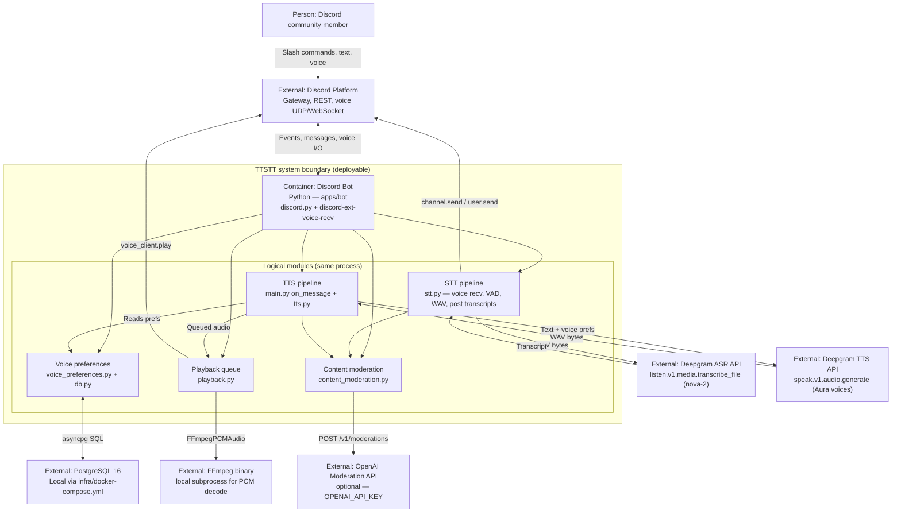

# Architecture retrospective — TTSTT

## Product vision statement (current)
**FOR** Discord communities—study servers, hobby groups, accessibility-minded guilds, and teams that already **live in text and voice channels**—**WHO** need **accessible participation**: people who are **hard of hearing or Deaf** and depend on **text for what was said**; people who are **non-verbal** or **prefer typing** and need their words **heard in voice**, not only read in a fast-moving channel; and anyone in **noisy environments** or on **low-quality gear** where **clean listening isn’t reliable**—and who today rely on **manual repeats**, **screenshots**, or **fragmented workarounds** across bots and DMs,
**THE** **TTSTT** (Text To Speech To Text)
**IS A** **Discord bot plus companion API** that sits in your **server’s voice and text channels**
**THAT** turns **spoken contributions** into **postable text** and **reads written chat aloud** in **voice** with **each user’s chosen synthetic voice** (model, pacing, expressiveness, pitch, and speed)—so members who lean on **ears**, **eyes**, or **both** share the **same room** without bolting on a separate captioning product,
**UNLIKE** using **Discord alone**—where voice doesn’t become durable text by default and long text doesn’t **speak to the VC**—or **unlike** expecting everyone to **migrate** to a single VC stack just to get **basic bridging**,
**OUR PRODUCT** **meets people on Discord**, uses **slash and chat commands** as the primary interface, and runs **speech AI on infrastructure you control** (API + Postgres) so prefs and processing stay **transparent and tunable** for the community,
**POWERED BY** **large-model automatic speech recognition** that converts spoken utterances into accurate, postable text **together with** **neural text-to-speech** that renders lines as natural, consistent audio—fast enough to feel usable during **live voice hangs**.

## What has Changed
Nothing has really shifted in **audience**, **problem**, **key differentiator**, or the **POWERED BY** line since the vision was first committed; our work stayed inside that framing (vendor-agnostic ASR/TTS in the statement, Deepgram in `apps/bot` today).

## Week 4 intended architecture

The team’s Week 4 submission is captured in [`architecture/architecture.md`](../architecture/architecture.md):

- [C4 System Context](../architecture/architecture.md#c4-system-context) — TTSTT as a Discord bot plus companion backend, with Discord, Whisper-class ASR, Piper-class neural TTS, and PostgreSQL as externals.
- [C4 Container Diagram](../architecture/architecture.md#c4-container-diagram) — four in-system containers: Discord Bot, Companion API, Audio Processing (ffmpeg), and a Postgres-backed preference/state store.

In Week 4 the team planned a **consolidated, self-hostable stack** where members interact only through Discord (slash and chat commands), a Python **Discord bot** orchestrates voice and text events, a separate **Companion API** owns settings and coordination, an **audio processing** layer normalizes and transforms buffers around ASR/TTS, and **PostgreSQL** holds per-user and per-guild voice preferences and runtime metadata—calling **vendor-agnostic** Whisper-class ASR for speech-to-text and Piper-class neural TTS for text-to-speech, with ffmpeg handling pitch, tempo, and loudness so live transcription and playback stay usable during voice hangs.

## Decisions that shifted

Two architectural choices diverged from the Week 4 plan during consolidation and Sprint 2 remediations.

### Deepgram for ASR and TTS (instead of Whisper-class + Piper-class)

**Context:** Week 4 called for swappable, self-hostable speech AI; in practice Noelle’s spike already proved live voice → Deepgram → text on Discord, and the team needed a single working path in `apps/bot` before splitting containers or running local models. Running Whisper and Piper on operator-controlled infra would have added GPU/hosting work on top of voice-receive debugging and Postgres prefs.

**Decision:** Standardize the deployable bot on **Deepgram** for both pre-recorded ASR (`nova-2`) and Aura TTS, behind thin client wrappers in `transcription.py` and `tts.py`, with one `DEEPGRAM_API_KEY`.

**Consequences:** The team accepts **vendor lock-in** and **metered API cost** for both directions of the bridge, defers true provider swapping and fully self-hosted inference, and must keep Deepgram SDK/API shape changes in sync—but gains **one credential**, **lower integration surface**, and a path that already matched prototype latency expectations for live hangs.

**Classification:** **Deliberate and prudent** — a conscious trade of the W4 abstraction story for consolidation speed and a proven integration, not an accidental drift; the team knew self-hosted Whisper/Piper was deferred, not abandoned in principle.

### Content moderation on STT and TTS paths

**Context:** Peer red-team review ([`docs/red-team-report-ttstt-received.md`](red-team-report-ttstt-received.md)) showed raw Deepgram transcripts and listened-user TTS going to Discord with no screening—phishing links, slurs, and sensitive speech (self-harm, medical, minor disclosure) could appear in public channels or be read aloud. That gap was not in the Week 4 C4 diagrams.

**Decision:** Add `apps/bot/content_moderation.py` on the **hot path**: `moderate_for_transcript()` before `channel.send` in `stt.py`, `moderate_for_tts()` before synthesis in `main.py`—URL redaction, regex/heuristic sensitive-content routing to **private DMs** (with 988 copy for self-harm), and optional **OpenAI Moderation API** when `OPENAI_API_KEY` is set.

**Consequences:** Every transcript and TTS enqueue pays **extra latency and logic**; operators may need a **second API key**; pattern lists require maintenance and still do not equal full trust-and-safety—but the bot no longer treats provider output as safe to relay verbatim, and `/join` documents that transcribed speech may be moderated or DMed.

**Classification:** **Deliberate and prudent** — driven directly by documented harm scenarios in review, implemented as a focused module rather than bolting checks into Discord handlers ad hoc.

## C4 container diagram (current implementation)

This reflects the **deployable** system in `apps/bot` as of today—not the target layout in [`architecture/architecture.md`](../architecture/architecture.md) (no Companion API yet; STT/TTS/moderation/playback run in one process).

### External dependencies and call sites

| System | Role | Env var | Call site |
|--------|------|---------|-----------|
| Discord Platform | Gateway, commands, text/voice I/O | `DISCORD_TOKEN` | `apps/bot/main.py` (`bot.start`, voice connect, `on_message`); `apps/bot/stt.py` (transcript posts); `apps/bot/playback.py` (`voice_client.play`) |
| PostgreSQL | TTS voice preferences | `DATABASE_URL` | `apps/bot/db.py`, `apps/bot/voice_preferences.py` |
| Deepgram ASR | Speech-to-text | `DEEPGRAM_API_KEY` | `apps/bot/transcription.py` ← `apps/bot/stt.py` |
| Deepgram TTS | Text-to-speech | `DEEPGRAM_API_KEY` | `apps/bot/tts.py` ← `apps/bot/main.py` |
| OpenAI Moderation | Optional content safety | `OPENAI_API_KEY` | `apps/bot/content_moderation.py` ← `main.py`, `stt.py` |
| FFmpeg | WAV → PCM for voice playback | `FFMPEG_EXECUTABLE` | `apps/bot/playback.py` |

## Code freeze

### Tech debt

Short list of debt the team is carrying into freeze and demo night. Fowler quadrants: **deliberate / inadvertent** × **prudent / reckless**.

| Debt item | Quadrant | Before freeze or through demo? |
|-----------|----------|--------------------------------|
| **Monolithic bot** — STT, TTS, moderation, playback, and prefs in one `apps/bot` process; no Companion API or separate audio container from Week 4. | Deliberate, prudent | **Live with it** through demo night; splitting containers is post-demo scope. |
| **Deepgram-only speech stack** — ASR/TTS interfaces exist but only Deepgram is wired; self-hosted Whisper/Piper and provider swap remain on paper. | Deliberate, prudent | **Live with it**; demo runs on one API key and known latency. |
| **Unpinned `discord-ext-voice-recv` from GitHub HEAD** — supply-chain risk flagged in peer red-team ([Finding 1.1](red-team-report-ttstt-received.md)). | Inadvertent, reckless | **Pin to a tag or commit SHA before freeze if time allows**; otherwise document the pin as the first post-demo chore and accept HEAD risk for demo installs only. |
| **Agent debug logging in `transcription.py` / `stt.py`** — writes to a developer-local `.cursor/debug-*.log` path on the STT hot path. | Inadvertent, reckless | **Remove before code freeze**; it is not operator-facing telemetry and should not ship in the frozen branch. |
| **Moderation is heuristic + optional OpenAI** — not a full trust-and-safety pipeline; regex/DM routing can miss edge cases. | Deliberate, prudent | **Live with it** for demo; expand coverage after freeze if the course allows. |
| **`architecture/architecture.md` still describes the W4 target** (Companion API, Whisper/Piper) while `apps/bot` is the as-built system. | Inadvertent, prudent | **Light doc sync if time** (cross-link this retrospective); otherwise **live with it** and treat this file as the as-built record for W10. |

### With another sprint

If the team had one more sprint before demo, it would **stand up the Companion API and pinned provider boundaries first, pin `discord-ext-voice-recv` and run automated live voice/STT checks in CI, then consolidate prototypes**—so demo week spends time on accessibility polish and operator docs instead of monolith glue and supply-chain surprises.