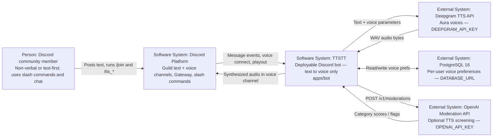
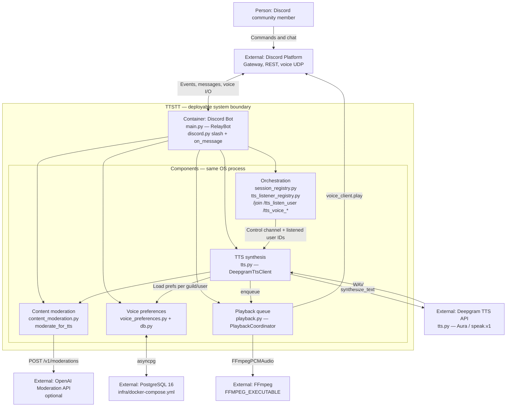

# Architecture retrospective — TTSTT

## Product vision

See [`docs/product-vision.md`](product-vision.md) for the current Moore statement, narrative, and HMW.

## What has Changed

The deployable bot is now **TTS-only**. We **removed speech-to-text** (voice receive, ASR, transcript posting, and `/stt_*` commands) from `apps/bot`. The product still serves **text → voice** accessibility; we are no longer building **voice → text** in the consolidated bot. **Audience** and **problem** narrow accordingly: Deaf/hard-of-hearing users who need captions are out of scope for this codebase until STT returns. **POWERED BY** is **Deepgram Aura TTS** only (no ASR in the deployable path).

## Week 4 intended architecture

The team’s Week 4 submission is captured in [`architecture/architecture.md`](../architecture/architecture.md):

- [C4 System Context](../architecture/architecture.md#c4-system-context) — TTSTT as a Discord bot plus companion backend, with Discord, Whisper-class ASR, Piper-class neural TTS, and PostgreSQL as externals.
- [C4 Container Diagram](../architecture/architecture.md#c4-container-diagram) — four in-system containers: Discord Bot, Companion API, Audio Processing (ffmpeg), and a Postgres-backed preference/state store.

In Week 4 the team planned a **consolidated, self-hostable stack** where members interact only through Discord (slash and chat commands), a Python **Discord bot** orchestrates voice and text events, a separate **Companion API** owns settings and coordination, an **audio processing** layer normalizes and transforms buffers around ASR/TTS, and **PostgreSQL** holds per-user and per-guild voice preferences and runtime metadata—calling **vendor-agnostic** Whisper-class ASR for speech-to-text and Piper-class neural TTS for text-to-speech, with ffmpeg handling pitch, tempo, and loudness so live transcription and playback stay usable during voice hangs.

## Decisions that shifted

Three architectural choices diverge from the Week 4 plan during consolidation, Sprint 2 remediations, and the **TTS-only** scope cut.

### TTS-only deployable bot (STT removed)

**Context:** STT required `discord-ext-voice-recv`, Opus ingress handling, utterance buffering, and Deepgram ASR—significant complexity and operator surface for a feature the team is not shipping in the frozen demo path.

**Decision:** Remove `apps/bot/stt.py`, `apps/bot/transcription.py`, STT slash commands, and the `discord-ext-voice-recv` dependency. The bot connects with standard `discord.py` voice clients for **playback only**.

**Consequences:** No in-bot captions for voice chat; simpler voice connect/disconnect; smaller dependency tree; red-team and moderation work focuses on **TTS input** only.

**Classification:** **Deliberate and prudent** — explicit scope reduction for demo and maintenance, not accidental deletion of unfinished STT.

### Deepgram for TTS (instead of Piper-class)

**Context:** Week 4 called for swappable, self-hostable speech AI; in practice the team needed a single working TTS path in `apps/bot` before splitting containers or running local models.

**Decision:** Standardize the deployable bot on **Deepgram Aura TTS**, behind a thin client wrapper in `tts.py`, with `DEEPGRAM_API_KEY`.

**Consequences:** The team accepts **vendor lock-in** and **metered API cost** for TTS, defers Piper/self-hosted inference, and must keep Deepgram SDK/API shape changes in sync—but gains **one credential** and a path that already matched prototype latency expectations for live hangs.

**Classification:** **Deliberate and prudent** — conscious trade of the W4 abstraction story for consolidation speed; self-hosted Piper remains deferred in principle.

### Content moderation on the TTS path

**Context:** Peer red-team review ([`docs/red-team-report-ttstt-received.md`](red-team-report-ttstt-received.md)) showed listened-user TTS could read harmful or sensitive text aloud in public voice. That gap was not in the Week 4 C4 diagrams.

**Decision:** Add `apps/bot/content_moderation.py` on the **hot path**: `moderate_for_tts()` before synthesis in `main.py`—heuristic sensitive-content blocking, link blocking, and optional **OpenAI Moderation API** when `OPENAI_API_KEY` is set.

**Consequences:** Every TTS enqueue pays **extra latency and logic**; operators may need a **second API key**; pattern lists require maintenance and still do not equal full trust-and-safety—but the bot no longer treats chat text as safe to read aloud verbatim, and `/join` documents that listened messages may be screened.

**Classification:** **Deliberate and prudent** — driven by documented harm scenarios in review, implemented as a focused module rather than bolting checks into Discord handlers ad hoc.

## C4 diagrams (current implementation)

These diagrams describe the **deployable** system in `apps/bot` as of today—not the Week 4 target in [`architecture/architecture.md`](../architecture/architecture.md) (no Companion API, no separate audio container, **no STT/ASR**). Use this section as the as-built C4 record for demo and code freeze.

### System Context

The member interacts only through Discord. TTSTT reads listened users’ text, synthesizes speech, and plays audio back into the voice channel. Preferences live in Postgres.

### Container diagram

One process (`python -m apps.bot.main`) hosts orchestration, TTS, moderation, playback, and persistence. FFmpeg runs as a local subprocess for WAV → PCM decode before Discord playout.

### Text → speech flow

1. Operator runs `/join` in a text channel and connects the bot to a voice channel (`SessionRegistry` stores the control channel).
2. Operator runs `/tts_listen_user` for members whose messages should be read aloud (`TtsListenerRegistry`).
3. A listened user posts in the control channel; `on_message` checks session + listener membership.
4. `moderate_for_tts()` blocks or allows the line (heuristics + optional OpenAI).
5. `voice_preferences` loads per-user voice settings from Postgres; `tts.py` calls Deepgram.
6. `playback.py` decodes WAV via FFmpeg and plays sequentially into the guild voice client.

### External dependencies and call sites

| System | Role | Env var | Call site |
|--------|------|---------|-----------|
| Discord Platform | Gateway, slash commands, text events, voice connect/play | `DISCORD_TOKEN` | `apps/bot/main.py`; `apps/bot/playback.py` |
| PostgreSQL | Per-guild/user TTS voice prefs | `DATABASE_URL` | `apps/bot/db.py`, `apps/bot/voice_preferences.py` |
| Deepgram TTS | Text-to-speech synthesis | `DEEPGRAM_API_KEY` | `apps/bot/tts.py` ← `apps/bot/main.py` |
| OpenAI Moderation | Optional TTS input screening | `OPENAI_API_KEY` | `apps/bot/content_moderation.py` ← `main.py` |
| FFmpeg | WAV → PCM for `FFmpegPCMAudio` | `FFMPEG_EXECUTABLE` | `apps/bot/playback.py` |

## Code freeze

### Tech debt

Short list of debt the team is carrying into freeze and demo night. Fowler quadrants: **deliberate / inadvertent** × **prudent / reckless**.

| Debt item | Quadrant | Before freeze or through demo? |
|-----------|----------|--------------------------------|
| **Monolithic bot** — TTS, moderation, playback, and prefs in one `apps/bot` process; no Companion API or separate audio container from Week 4. | Deliberate, prudent | **Live with it** through demo night; splitting containers is post-demo scope. |
| **Deepgram-only TTS** — provider interface exists but only Deepgram is wired; self-hosted Piper and provider swap remain on paper. | Deliberate, prudent | **Live with it**; demo runs on one API key and known latency. |
| **No STT / captions** — voice → text removed from `apps/bot`; W4 vision and accessibility story for Deaf users is not met by the deployable bot. | Deliberate, prudent | **Accepted** for demo scope; reintroduce only if product direction returns. |
| **Moderation is heuristic + optional OpenAI** — not a full trust-and-safety pipeline; regex blocking can miss edge cases. | Deliberate, prudent | **Live with it** for demo; expand coverage after freeze if the course allows. |
| **`architecture/architecture.md` still describes the W4 target** (Companion API, Whisper/Piper, bidirectional bridge). As-built C4 for the deployable bot lives in **this file** (System Context + Container above). | Inadvertent, prudent | **Live with it** for W4 submission artifact; use this retrospective for current diagrams. |

### With another sprint

If the team had one more sprint before demo, it would **stand up the Companion API and pinned provider boundaries first, then consolidate prototypes**—so demo week spends time on TTS accessibility polish and operator docs instead of monolith glue. **STT is out of current scope** unless the product vision is reopened.
