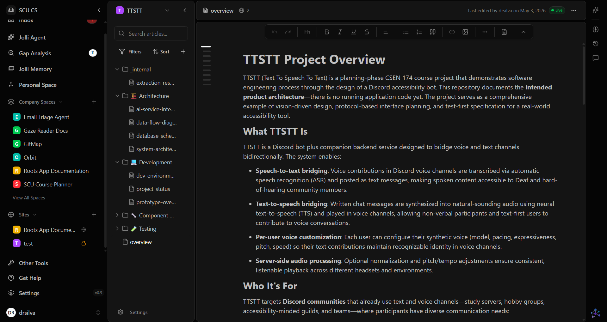

# Sprint 1 Testing Write-Up

## Part 1: Brief Overview

Sprint 1 focused on establishing test-driven seams for two early bot workflows: speech transcription and Discord voice channel orchestration. We used future-facing unit tests to define behavior contracts before expanding implementation complexity. The resulting code in `apps/bot/transcription.py` and `apps/bot/discord_voice.py` is intentionally small, dependency-injected, and easy to validate with fake clients.

## Part 2: Red-to-Green Narrative (Transcription + Discord Voice)

For `transcription.py`, we used a red-green cycle to tighten output quality for chat posting. We first wrote a failing test asserting that whitespace-only ASR output should normalize to an empty string, because empty/noise transcripts should not become junk messages. The test failed as expected when `transcribe_audio()` returned raw provider output, then passed after a minimal change (`.strip()`) was added.

For `discord_voice.py`, tests were written to confirm the integration flow expected by users: authenticate, join the voice channel, and receive a stream for downstream transcription. The first test validated that the token is used, the voice channel is joined, and the same stream object is returned. A second test checked call sequence, ensuring the bot does not attempt to read audio before authentication/join orchestration has happened.

## Part 3: Skill Used (Superpowers)

The Part 3 work used the **Superpowers** skill set, specifically the test-driven-development guidance ("write test first, verify fail, implement minimal code, verify pass"). This reinforced disciplined red-green-refactor loops and discouraged implementation-first habits. In practice, this helped us keep functions narrow, avoid premature abstraction, and only add behavior when a failing test demanded it.

## Part 4: AI Critique of Two Generated Tests

### Test A: `test_connect_join_and_get_audio_stream_calls_steps_in_required_order`

This test partially expresses user needs (safe orchestration order), but it also leans toward implementation details by asserting an exact method-call log. It is somewhat brittle: a refactor that preserves behavior but changes internal call structure or helper boundaries could fail this test unnecessarily. A missing domain input is failure-path behavior (for example, authentication failure should prevent join and stream access), which is more user-relevant than strict internal sequencing.

### Test B: `test_transcribe_audio_trims_outer_whitespace_from_asr_output`

This test mostly captures user-facing behavior: resulting text should be readable and normalized before posting. It should survive many internal refactors as long as observable output remains trimmed. Missing inputs include non-ASCII whitespace, punctuation-only utterances, and "near-empty" outputs common in live Discord audio (e.g., breath sounds or filler tokens), which are domain-specific edge cases for ASR pipelines.

### Before/After Diff: Improving One Test

Below is one improvement pass for the call-order test, shifting it from strict internal sequence checks to behavior constraints that better match user outcomes.

```diff
--- a/unittests/test_discord_voice_connection_future.py
+++ b/unittests/test_discord_voice_connection_future.py
@@
-def test_connect_join_and_get_audio_stream_calls_steps_in_required_order() -> None:
-    # As a Discord user, the bot authenticates before joining and only then starts reading voice audio.
+def test_connect_join_and_get_audio_stream_joins_before_stream_access() -> None:
+    # As a Discord user, the bot must join voice before attempting to read a stream.
@@
-    call_log: list[str] = []
-
     class FakeDiscordVoiceClient:
+        def __init__(self) -> None:
+            self.joined = False
+
         def authenticate(self, token: str) -> None:
-            call_log.append(f"authenticate:{token}")
+            pass
@@
         def join_only_voice_channel(self) -> None:
-            call_log.append("join_only_voice_channel")
+            self.joined = True
@@
         def get_audio_stream(self) -> object:
-            call_log.append("get_audio_stream")
+            if not self.joined:
+                raise RuntimeError("stream requested before joining voice")
             return object()
@@
-    connect_flow("ordered_token", fake_client)
+    stream = connect_flow("ordered_token", fake_client)
@@
-    assert call_log == [
-        "authenticate:ordered_token",
-        "join_only_voice_channel",
-        "get_audio_stream",
-    ]
+    assert stream is not None
```

This version still enforces a critical order requirement, but it does so through an observable contract (no stream-before-join) rather than a tightly coupled call log.

