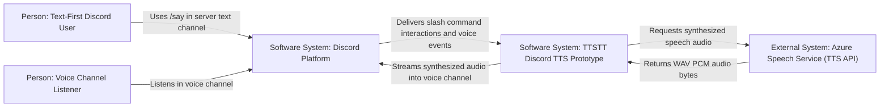
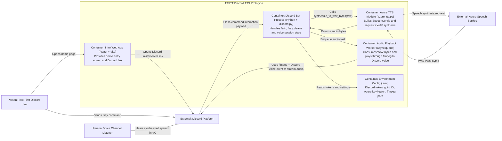

# TTSTT Discord TTS Prototype — Diego

This prototype is now Discord-first:

- The web app is an intro screen only.
- **Start Demo** opens your Discord server/invite URL.
- Main functionality runs in the Discord bot (`/join`, `/say`, `/leave`) with Azure Speech TTS.

## Architecture diagrams

### C4 Context diagram



### C4 Container diagram



## Quick Start

### Prerequisites

- Node.js 18+ and npm
- Python 3.11+
- ffmpeg on your PATH (required for Discord voice playback)

### 1) Configure secrets

Copy `.env.example` to `.env` in `prototypes/diego/` and fill in the Discord/Azure values.

Important: `.env` is gitignored. Never commit real secrets. If any key/token was leaked, rotate it immediately.

### 2) Run the Discord bot

```bash
cd prototypes/diego/discord_bot
python -m venv .venv
# Windows
.venv\Scripts\activate
# macOS / Linux
source .venv/bin/activate

pip install -r requirements.txt
python bot.py
```

### 3) Run the intro screen (optional)

```bash
cd prototypes/diego/frontend
npm install
npm run dev
```

Open `http://localhost:5173` and click **Open Discord Demo**.  
If you want this button to open a specific invite link, change `discordUrl` in `frontend/src/App.tsx`.

## Discord setup checklist

1. In [Discord Developer Portal](https://discord.com/developers/applications), create an app and add a bot.
2. Invite using OAuth scopes `bot` and `applications.commands`.
3. Bot permissions: Connect, Speak, Use Voice Activity.
4. In server voice chat: run `/join`, then `/say`.

## Environment variables

| Variable | Description |
|---|---|
| `DISCORD_BOT_TOKEN` | Bot token from Discord Developer Portal |
| `DISCORD_GUILD_ID` | Optional server ID for faster slash-command sync |
| `AZURE_SPEECH_KEY` | Azure Speech key |
| `AZURE_SPEECH_REGION` | Azure Speech region (e.g. `westus2`) |
| `AZURE_TTS_VOICE` | Azure voice short name (e.g. `en-US-JennyNeural`) |

